📝 Task Manager — Vue 3 + Pinia + TailwindCSS

A task management web application built with Vue 3, Pinia, TailwindCSS, and Vite.
The app allows users to manage tasks, assign categories, edit tasks, mark as completed, and delete tasks with confirmation dialogs.

📦 1. Setup & Installation
Clone the repository
git clone <your-repo-url>
cd <project-folder>

Install dependencies
npm install

Run the development server
npm run dev

Build for production
npm run build

Environment Variables

If your API requires environment variables, create a file:

.env

# Example .env file
VITE_SUPABASE_PROJECT_ID=your-project-id
VITE_SUPABASE_ANON_KEY=your-anon-key
VITE_API_BASE_URL=https://your-api.com/api

-----------------------------------------------------

🏛 2. State Management (Pinia)

The project uses Pinia as the global state manager.
Two main stores are implemented:

Task Store (taskStore.js)

Handles:

Loading all tasks

Loading task by ID

Loading tasks by category

Creating a task

Updating a task

Deleting a task

Category Store (categoryStore.js)

Handles:

Fetching all categories

Storing categories globally

Both stores communicate with the backend via /api/tasks and /api/categories.

-----------------------------------------------------
🧩 3. Component Architecture
src/
 ├─ api/              → API functions (tasks & categories)
 ├─ components/       → Reusable UI components
 │    ├─ TaskCard.vue
 │    ├─ LoadingSkelton.vue
 │    ├─ ErrorState.vue
 │    ├─ DeleteConfirm.vue
 │    ├─ TaskFormModal.vue   (Add / Edit Task)
 ├─ layouts/
 │    └─ MainLayout.vue
 ├─ pages/
 │    ├─ TaskList.vue        (Home / All Tasks)
 │    ├─ TaskDetail.vue
 │    ├─ CategoryTasks.vue
 │    ├─ Categories.vue
 │    ├─ TaskDetails.vue
 │    ├─ services.vue
 │    ├─ servicesDetails.vue
 ├─ stores/
 │    ├─ taskStore.js
 │    └─ categoryStore.js
 │    └─ servicesStore.js
 ├─ App.vue
 └─ main.js

-----------------------------------------------------
 ⭐ 4. Features Implemented
✅ Core Features

View all tasks

View tasks by category

Create new task (with modal)

Edit task (with modal)

Delete task (with confirmation popup)

Mark task as completed / unmark

View full task details

Responsive UI with TailwindCSS

🎁 Extra Features

Toast notifications using vue3-toastify

Smooth animations (modal fade-in)

Headless UI Listbox for category dropdown

Clean component architecture

Global loading & error state in stores

-----------------------------------------------------

⚠️ 5. Known Limitations

No user authentication (all actions publicly available)

API must follow the exact structure expected by the stores (id, title, description, category_id, priority, completed)

No pagination implemented (although supported in API)

-----------------------------------------------------

## 📸 6. Screenshots, decktop and mobile

> ضع صور الشاشات داخل المسار التالي:  
> **public/screenshots/**  
> مع الحفاظ على نفس أسماء الملفات المذكورة بالأسفل أو تغييرها وتحديث الروابط.

### 🏠 Home Page
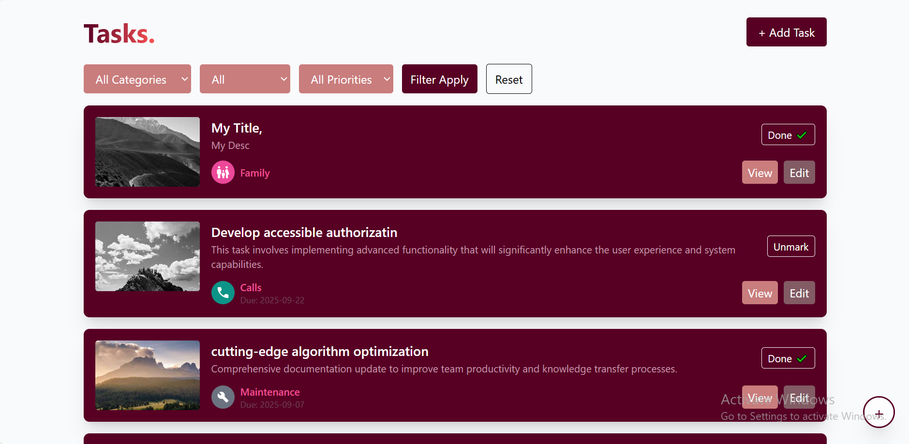
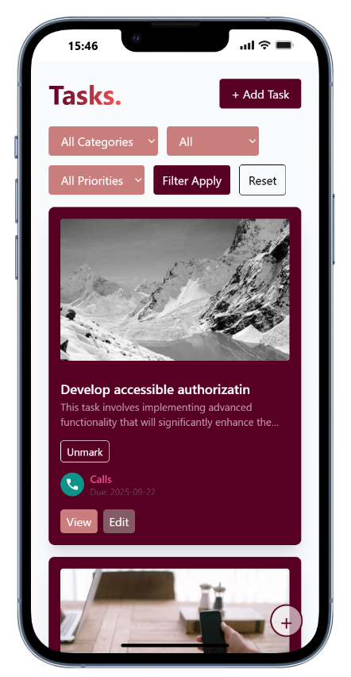

### 📂 Categories List
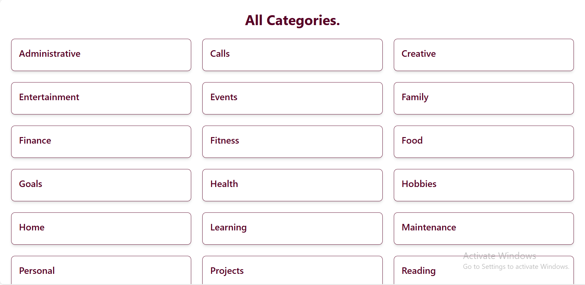
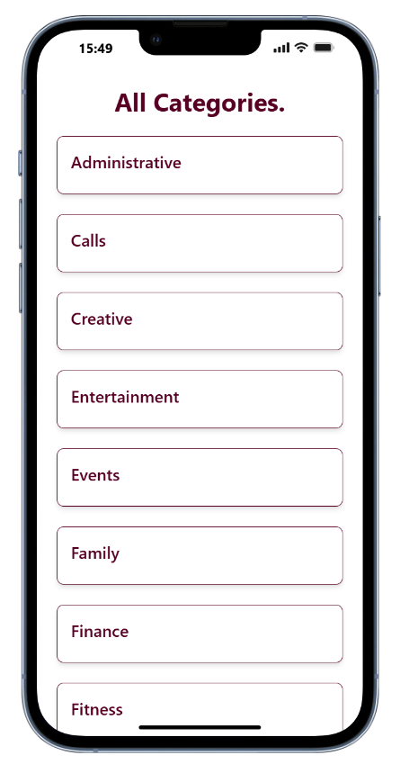

### 📄 Category Details
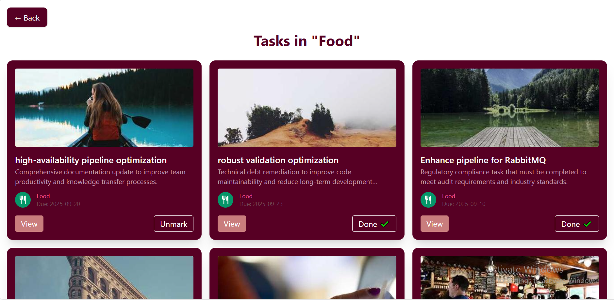
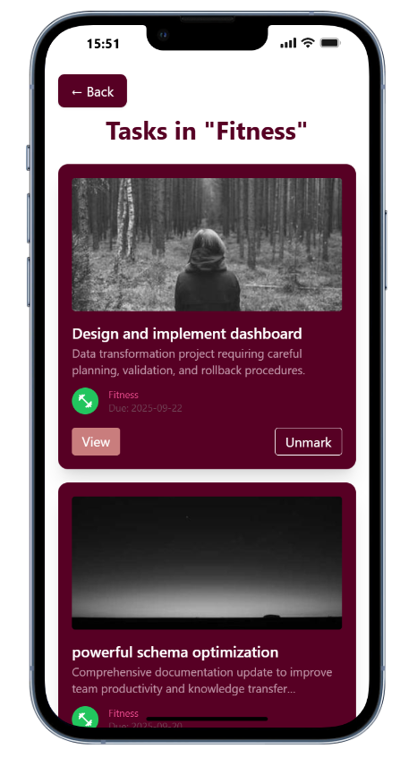

### ✅ Task Details
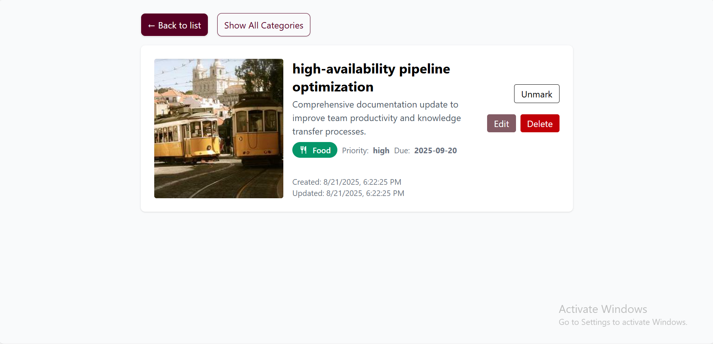
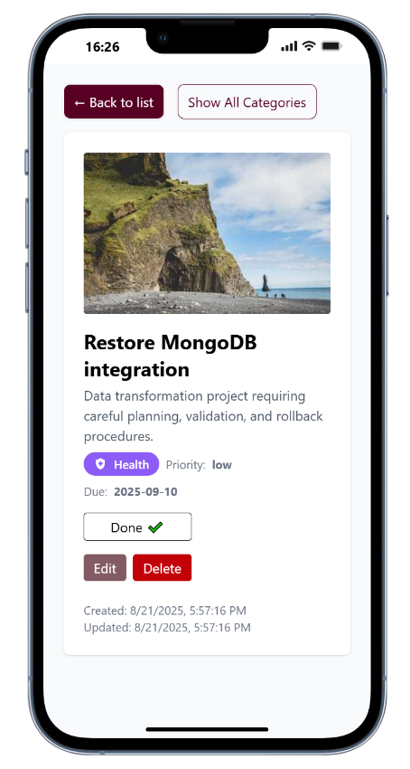

### ➕ Add / Edit Task Modal
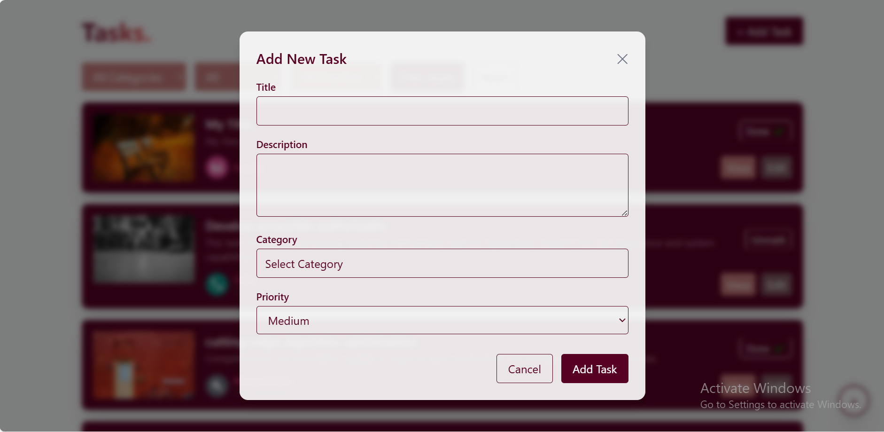
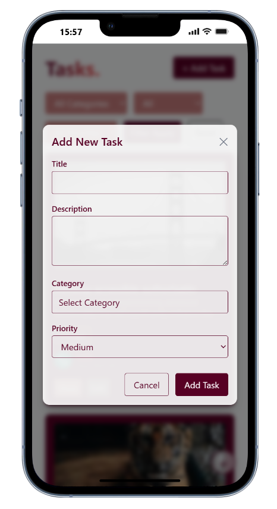

### ❌ Delete Confirmation
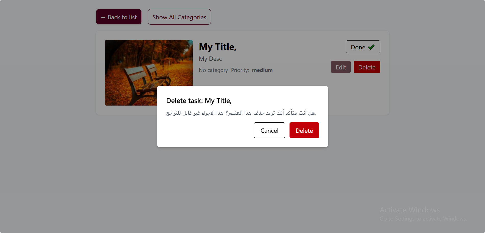
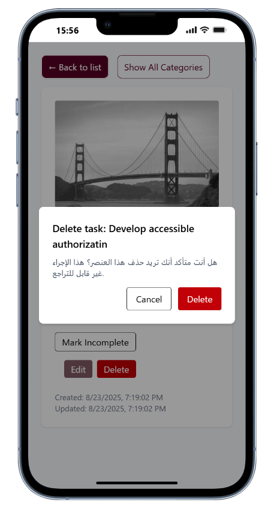

-----------------------------------------------------

👨‍💻 7. Developer

Frontend Developer: Mohamed Abdelbaset
Tech Stack: Vue 3, Pinia, TailwindCSS, Vite, REST APIs